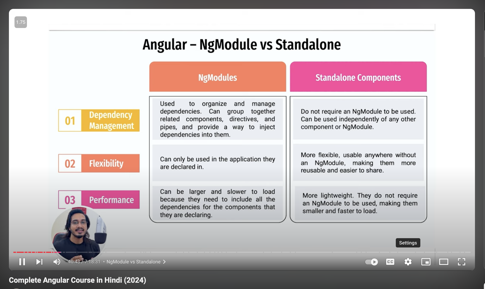

## Angular CLI

- makes angular code runnable on browser ( like converting to js )
- needs nodejs ( to run js ), npm

### Source code files

1. Files which convert ts code to js using angular cli:

- tsconfig.app.json
- tsconfig.json
- tsconfig.spec.json

2. main.ts -> first file to load up when app runs in browser
3. index.html -> main html file to be executed
4. angular.json -> angular cli code written
5. package.json -> have all the dependencies req for the project

### Componenets

@Component - is a decorator - to add extra metadata to this class

- selector - tells angular for which elements to look in html code
- templateurl - html code which is renedered for selector tag

Angular that actually instantiates the classes in the end. We never call **new SomeComponent()** anywhere in our code.

#### Standalone component

Standalone components are components that don’t rely on Angular modules (NgModules) to be used. Instead, they can declare their dependencies independently, which allows them to be directly imported into other standalone components, directives, pipes, or applications.


To check whether project is standalone or ng module based: Check **main.ts** Bootstrapping

In a standalone Angular project, the root component is bootstrapped directly without a module:
```
import { bootstrapApplication } from '@angular/platform-browser';
import { AppComponent } from './app/app.component';

bootstrapApplication(AppComponent)
  .catch(err => console.error(err));
```
In an NgModule-based project, bootstrapping typically looks like this:

```
import { platformBrowserDynamic } from '@angular/platform-browser-dynamic';
import { AppModule } from './app/app.module';

platformBrowserDynamic().bootstrapModule(AppModule)
  .catch(err => console.error(err));