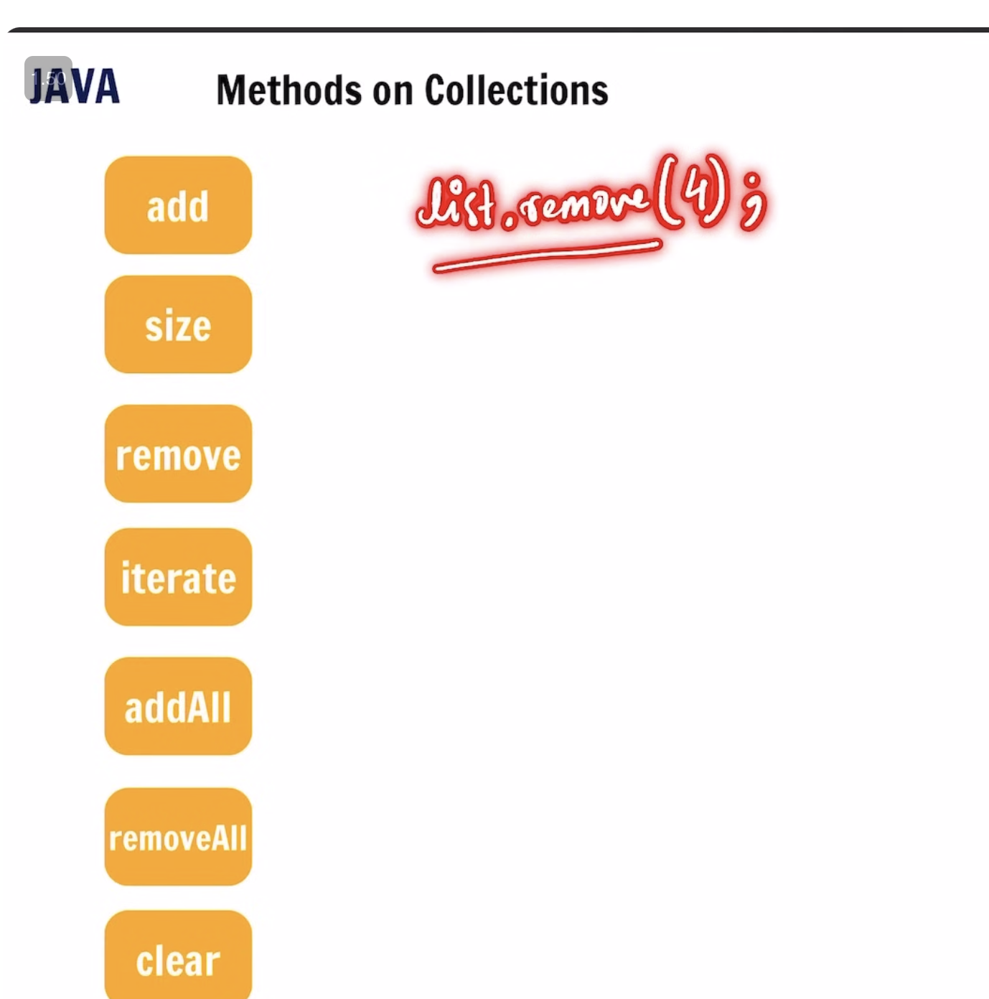
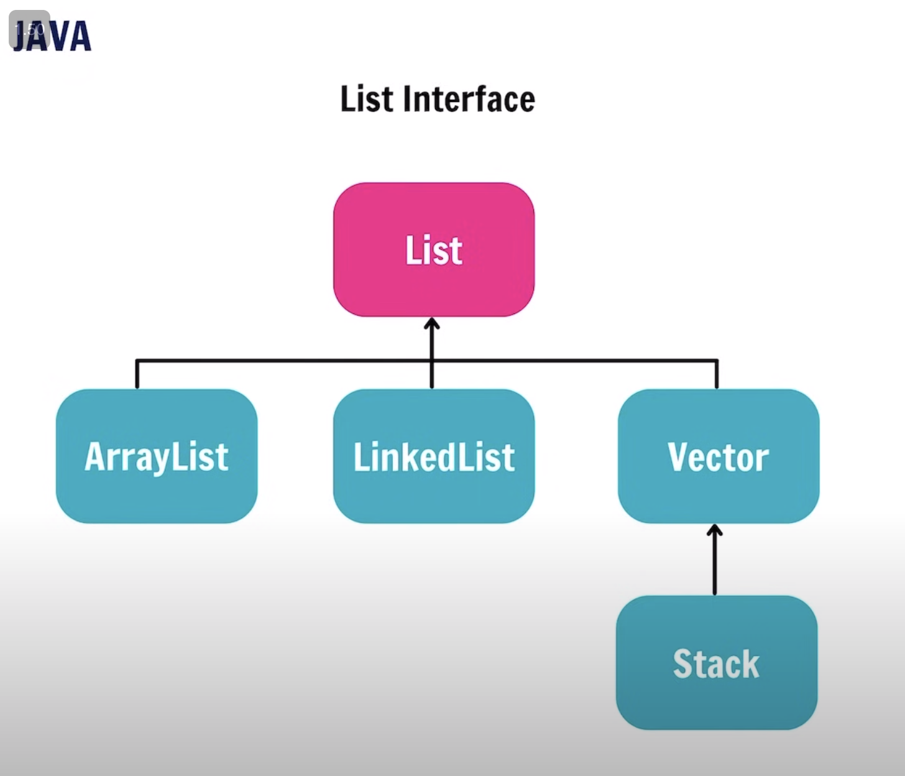
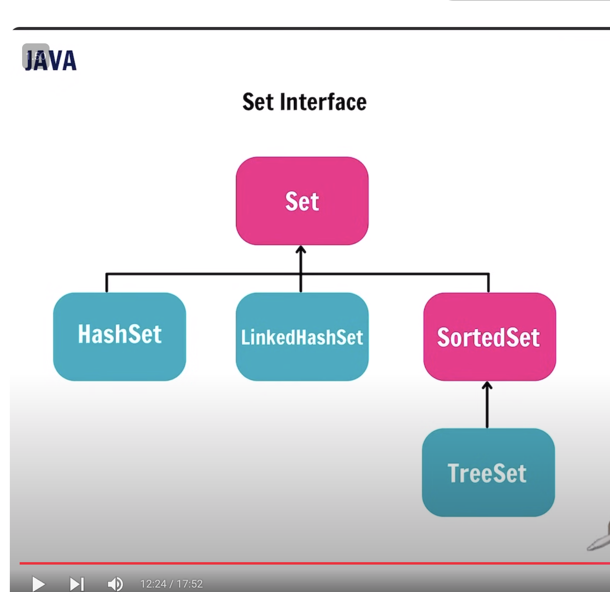
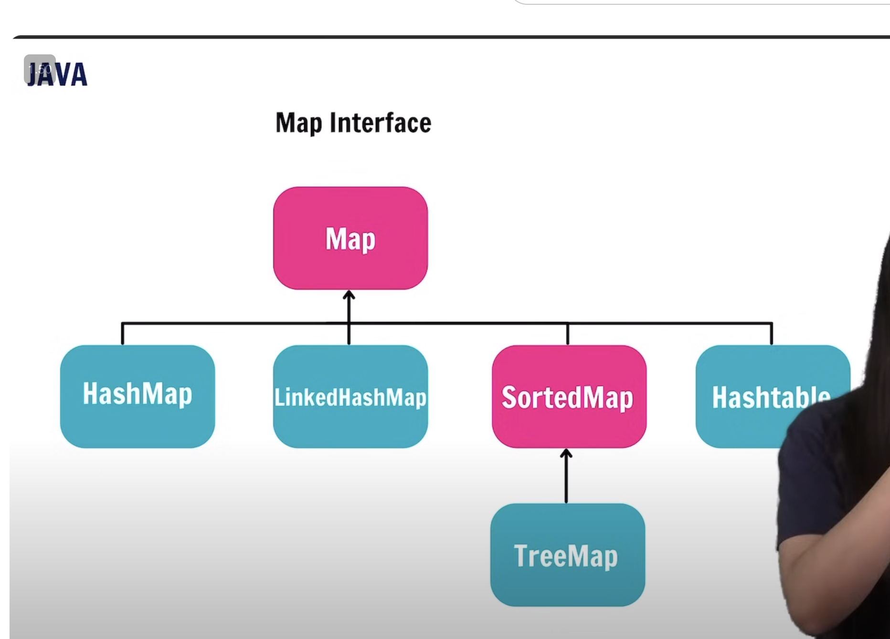

### Java Collections Framework

Are collections of some classes and interfaces

All mentioned below are interfaces:

Methods on collections:

1. List interface - has 4 classes - arrayList, LL , vector ( similar to arraylist, used in multithreading, as it is thread safe ) and stack

2. Queue interface - Dequeue( double ended queue, can add objects from both sides)

3. Set/Map interface - treeset (in sorted set)

